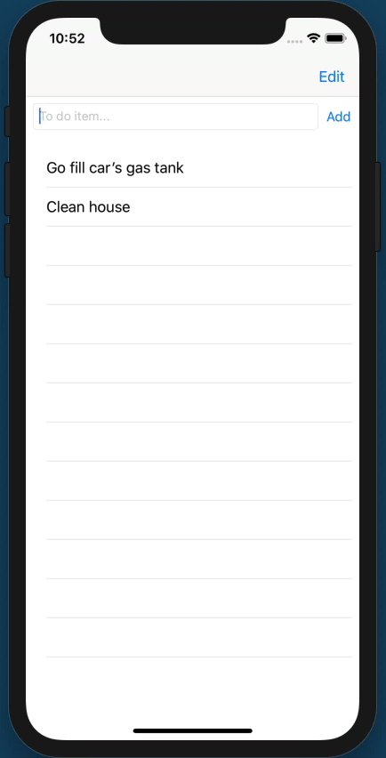

# Module Challenge: Table Views I - Tabled

This challenge allows you to practice the concepts and techniques learned in today's guided lesson and apply them in a concrete project. Your lesson explored table views and delegation. You demonstrate proficiency by creating an application that showcases the same features you learned in class.

## Instructions

**Read these instructions carefully. Understand exactly what is expected _before_ starting this Challenge.**

This is an individual assessment but you are permitted to consult with and support other members of your cohort. You are encouraged to follow the twenty-minute rule and seek support from your PM and Instructor in your cohort help channel on Slack. 

## Commits

Commit your code regularly and meaningfully. This helps both you (in case you ever need to return to old code for any number of reasons) and your project manager.

## Description

In this challenge, you build a ToDo list to help keep track of simple items you need to perform.

Your completed application will look like the following GIF:



## Questions

Demonstrate your understanding of today's concepts by answering the following free-form questions. Submit them as a text file along with your project.

* What is delegation and why do iOS developers use it?
* Why is a table view's data source a kind of delegation? And how does it differ from a table view's delegate?
* Why use animation in the table when adding, removing, or reordering items?
* Why use a model? Why not just update an array of items directly in your table?
* When do you call `reloadData`? When don't you?

## Project Setup

Follow these steps to set up your project:

- Create a new Single View application. Clean up the boilerplate in the application delegate and ViewController files.
- Set the project to be portrait only 
- In IB, add a text field, a button, and a table view (not a table view controller).
- Set the text field's placeholder to "To do item...". Name the button "Add".
- Add the field and the button to a horizontal stack view (8 points between the items). 
- Stretch the top, left, and right of the stack view to 8 points of the surrounding safe space.
- Stretch the table view to the bottom, left, and right to 8 points of the surrounding safe space and add a 20 point spacer at the top to its nearest neighbor, which is the stack view.
- Set the Add button's hugging priority to 500
- Add a cell to the table. Set its re-use identifier to "cell"
- Embed the view controller in a navigation controller.

## Setting up ViewController.swift

Make the following connections from IB:

* Add IBOutlets for the tableView and the textField.
* Add an action for the Add button called "add"

Then, in ViewController.swift

* Create a property called `reuseIdentifier` and set it to "cell".

## Building your Model

- Add a new Model.swift file to your project with the following contents:

```
import Foundation

class Model {
    static let shared = Model()
    private init() {}
    
    private var items: [String] = []
    
    func addItem(_ item: String) {
        // fill this in
    }
    
    func removeItem(at index: Int) {
        // fill this in
    }
    
    func moveItem(from index: Int, to destinationIndex: Int) {
        // fill this in
    }
    
    func itemCount() -> Int {
        return items.count
    }
    
    func item(at index: Int) -> String {
        return items[index]
    }
    
    let fileURL = URL(fileURLWithPath: NSHomeDirectory())
        .appendingPathComponent("Library")
        .appendingPathComponent("ToDo")
        .appendingPathExtension("plist")

    func saveData() {
        try! (items as NSArray).write(to: fileURL)
    }
    
    func loadData() {
        if let items = NSArray(contentsOf: fileURL) as? [String] {
            items = items
        }
    }
}
```

## Build The View Controller

Follow these steps to build your todo View Controller

* Implement add. Test that the text exists and is not empty. Then add it to your model and apply an insert row animation.
* Conform your ViewController to UITableViewDataSource and UITableViewDelegate. Add the protocol stubs supplied by Xcode.
* Implement "number of rows" and "cell for row" exactly as we did in class.
* Implement `viewWillAppear`. Set the table's delegate and data source and reload its data.
* Add swipe-to-delete functionality. Fill in the missing pieces that update the model and provide the delete row animation.

```
func tableView(_ tableView: UITableView, commit editingStyle: UITableViewCell.EditingStyle, forRowAt indexPath: IndexPath) {
        
    // Enable "magic" swipe-to-delete
    guard editingStyle == .delete else { return }

    // Implement here
}
```

* Similarly add row-reordering and fill in the missing pieces:

```
func tableView(_ tableView: UITableView, moveRowAt sourceIndexPath: IndexPath, to destinationIndexPath: IndexPath) {

    // Implement here

}
```

## Support Interactive Edits

These steps introduce interactive table edits in your project:

* In Interface Builder, add a bar button item to the top right of your view controller. Set it to an "Edit" system item.
* Add the following code to your source and then connect the Edit bar button item in IB to the edit table action.

```
    @IBAction func editTable(_ sender: Any) {
        tableView.setEditing(true, animated: true)
        navigationItem.rightBarButtonItem = UIBarButtonItem(barButtonSystemItem: .done, target: self, action: #selector(stopEditingTable(_:)))
    }
    
    @objc
    func stopEditingTable(_ sender: Any) {
        tableView.setEditing(false, animated: true)
        navigationItem.rightBarButtonItem = UIBarButtonItem(barButtonSystemItem: .edit, target: self, action: #selector(editTable(_:)))
    }
```

## Minimum Viable Product

Your finished project must include all of the following requirements:

* Your table looks and behaves like the one in the animated GIF, including clearing the text input after adding items.
* You can add, delete, and reorder items.
* Items persist from one launch to the next.
* The bar button properly switches between Edit and Done for interactive edits.
 
## Stretch Problems

After finishing your required elements, push your work further. These goals may or may not be things you learned in this module but they build on the material you just studied. Time allowing, stretch your limits and see if you can deliver on the following optional goals:

* Add a Share bar button that presents an activity controller so you can email or print a copy of your list.
* Allow the user to edit an item by tapping on it. The text appears in the text field and the button changes from Add to Done. The bar button at the top right changes from Edit to Cancel. If cancelled, the field is cleared, the buttons return to the previous names, and no changes are applied. If the user taps Done (and the text is not empty), the changes replace the origin entry, the buttons return to the previous names, and the table reloads to show the new value.
* Introduce shake-to-undo to undo the most recent edit.
